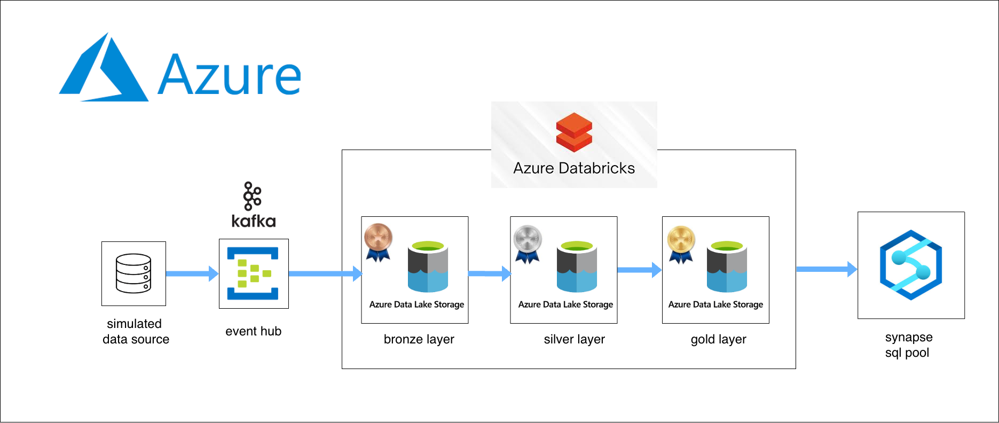

# Streaming Healthcare Data Engineering Pipeline for Patient Admission & Discharge (Azure)

### Introduction

The purpose of this project is to develop a centralized, real-time data platform to address challenges in patient flow management and bed occupancy across regional hospitals. The primary objectives are to minimize waiting times, identify department-level bottlenecks, and generate demographic insights using gender and age-based KPIs. The proposed solution utilizes a Medallion architecture (Bronze, Silver, Gold) and a Star schema to process real-time admission data and daily batch extracts from Electronic Health Record (EHR) systems. The pipeline handles schema evolution, implement SCD Type 2 for history tracking, and manage data quality issues like duplicates or missing timestamps during the Silver layer processing.

### pipeline design

