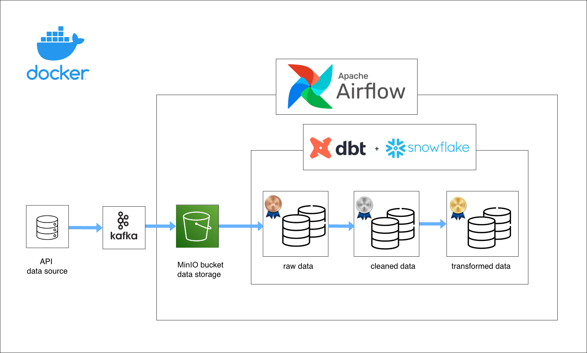

# Streaming Healthcare Data Engineering Pipeline for Patient Admission & Discharge (Azure)

## Introduction

This project is an end‑to‑end real‑time data pipeline that captures live stock market data and transforms it into analytics‑ready insights using a modern data stack. The pipeline streams data from the Finnhub Stock API, processes and stores it with Apache Kafka, and orchestrates transformations with Airflow, DBT, and Snowflake — all while being fully containerized with Docker for scalable deployment. 

## Pipeline design

## Goals

This repository aims to:

1. Ingest live financial data: Fetch real‑time stock quotes from the Finnhub API and stream them reliably into a message bus. 

2. Enable durable storage: Write raw streaming data into a MinIO bucket (S3‑compatible) as the Bronze layer for long‑term storage and traceability. 

3. Orchestrate automated workflows: Use Apache Airflow to schedule and manage end‑to‑end pipeline jobs, from ingestion to loading into Snowflake. 

4. Transform data into insight: Apply DBT transformations in Snowflake to clean and model data through Bronze → Silver → Gold layers, producing analytics‑ready views. 

5. Support downstream use cases: Provide a solid foundation for analytics, dashboards, reporting, or ML workflows on real‑time financial datasets. 

## Key Pipeline Steps

Kafka Setup – Configure topics and broker services for streaming. 

Producer – Python script to fetch and publish live stock quotes to Kafka. 

Consumer – Script to consume Kafka messages and store them in MinIO buckets. 

Airflow DAGs – Define workflows to load MinIO data into Snowflake and trigger DBT models. 

Snowflake Warehouse – Create staging tables and schemas to house raw and intermediate data. 

DBT Models – Build layered models for cleaning, validation, and analytical views.
