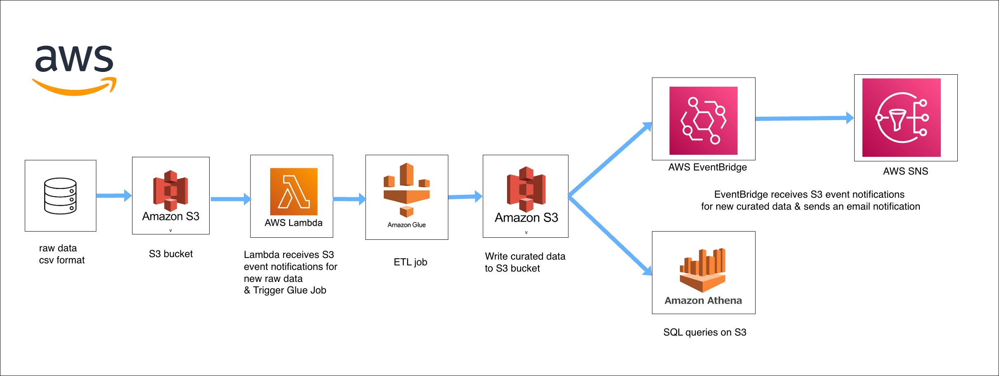

# Retail Data ETL Pipeline on AWS with Terraform (Batch Processing)

This project demonstrates an automated, serverless batch ETL pipeline on AWS for processing raw retail data. It shows how to integrate core AWS services using Terraform to move data from raw storage to curated datasets, ready for analysis.

## Project Overview

The pipeline ingests raw retail datasets uploaded to Amazon S3 and automatically processes them using AWS serverless services. Terraform is used to define and deploy all cloud resources, ensuring reproducibility, consistency, and easy teardown. The goal is to build a scalable ETL workflow that extracts, transforms, and loads retail data while enabling event-driven notifications and interactive querying of curated data.

## Pipeline Design

## Architecture & Workflow
* Infrastructure Provisioning (Terraform): Terraform modules provision S3 buckets, IAM roles, Lambda functions, Glue jobs, EventBridge rules, SNS topics, and Athena configurations.

* Data Ingestion: Upload raw retail files (CSV) to an S3 bucket.

* Triggering the Pipeline: An AWS Lambda function detects new files in S3 and initiates the ETL process.

* Data Transformation: AWS Glue jobs curate the raw retail data.

* Event Notifications: Amazon EventBridge tracks pipeline events and routes them to SNS, sending real-time notifications (email alerts) when jobs complete.

* Data Querying: Curated datasets are stored back in S3 and can be queried using AWS Athena for analytics and reporting.

## Technologies Used
* Terraform – Infrastructure as Code for provisioning and managing AWS resources

* Amazon S3 – Storage for raw and curated datasets

* AWS Lambda – Event-driven function to trigger ETL jobs

* AWS Glue – Serverless ETL service for data transformation

* Amazon EventBridge & Amazon SNS – Notifications for monitoring pipeline events

* AWS Athena – Querying curated datasets
